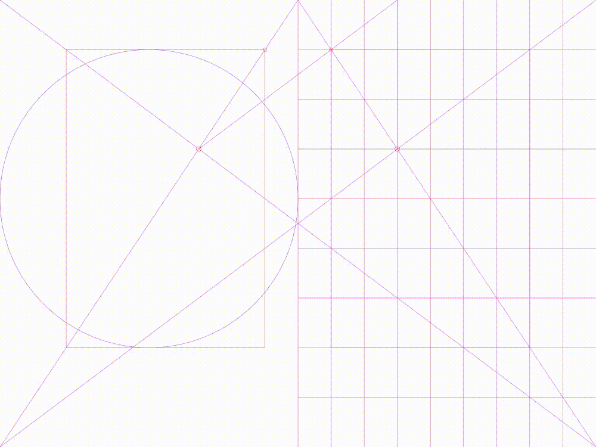

# ⧉ Classic Layout Systems

A library of layout systems and grids to find balance through classic form and proportions.

*"No matter how much technology develops, certain eternal principles can still be applied to organize and present information." 
The fact that we live in the digital age with new media does not mean that classical concepts of balance and harmony are any less important."* -- <cite>[The Layout Book][1]</cite>

*"Though largely forgotten today, methods and rules upon which it is impossible to improve have been developed for centuries."* -- <cite>[Jan Tschichold][2]</cite>

*"Columns are boring. Build with relationships."* 😄 -- <cite>[Nathan Ford][3]</cite>

## Available Formats

### ♦ Sketch Library
Download and add the `.sketch` file from within Sketch: **Preferences... > Libraries > Add Library...**.

### ♦ Illustrator
Download and add the `.ai` file from within Illustrator: **Window > Symbol Libraries > Other Library...**.

Or open as a standard Illustrator file to access the original drawings artboards.

### ♦ SVG
Convenience SVG exports.

## Measurements
🔢📐All geometry is exported with two-digit accuracy to optimize for Sketch and SVG rendering.

If you need higher resolution feel free to use Ilustrator artboards directly.

## Layout Systems

**Van de Graaf Canon** 
 

---

**Villard de Honnecourt's Diagram** 

---

 **Golden Section** 
 

---
 
**Fibonacci Grid** 
 

---

**Fibonacci Proportions** 

---

**Renard Series** 

---

🙏 to [The Layout Book][1] for the inspiration.

[1]: https://www.bloomsbury.com/uk/the-layout-book-9781472568236/
[2]: https://en.wikipedia.org/wiki/Canons_of_page_construction
[3]: https://alistapart.com/article/content-out-layout/

[![CC BY-SA 4.0][cc-by-sa-shield]][cc-by-sa]

[cc-by-sa]: http://creativecommons.org/licenses/by-sa/4.0/
[cc-by-sa-shield]: https://img.shields.io/badge/License-CC%20BY--SA%204.0-lightgrey.svg
