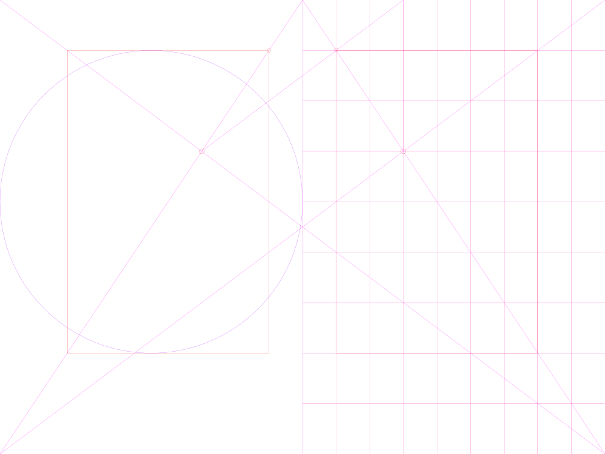

# Classic Layout Systems

A library of classic layout design systems and grids to find balance through form and proportions:

_"No matter how much technology develops, certain eternal principles can still be applied to organize and present information."
The fact that we live in the digital age with new media does not mean that classical concepts of balance and harmony are any less important."_ -- <cite>[The Layout Book][1]</cite>

_"Though largely forgotten today, methods and rules upon which it is impossible to improve have been developed for centuries."_ -- <cite>[Jan Tschichold][2]</cite>

_"Columns are boring. Build with relationships."_ -- <cite>[Nathan Ford][3]</cite>

😄

### Measurements

🔢📐All geometry is exported with two-digit accuracy to optimize for Sketch and SVG rendering.
If you need higher resolution feel free to use Ilustrator artboards directly.

## Van de Graaf Canon

--

[1]: https://www.bloomsbury.com/uk/the-layout-book-9781472568236/
[2]: https://en.wikipedia.org/wiki/Canons_of_page_construction
[3]: https://alistapart.com/article/content-out-layout/

[![CC BY-SA 4.0][cc-by-sa-shield]][cc-by-sa]

[cc-by-sa]: http://creativecommons.org/licenses/by-sa/4.0/
[cc-by-sa-shield]: https://img.shields.io/badge/License-CC%20BY--SA%204.0-lightgrey.svg
